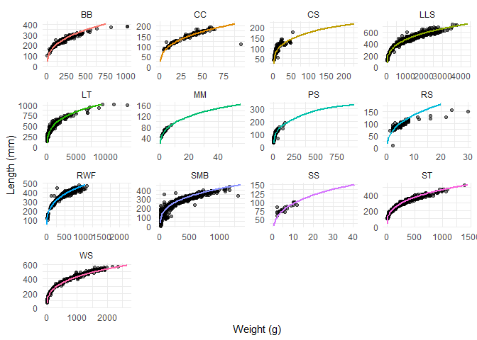
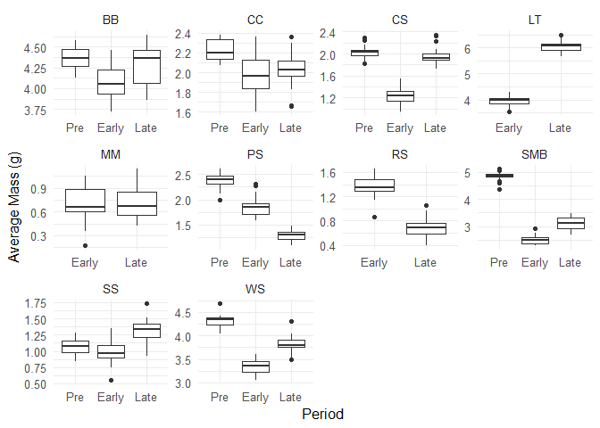
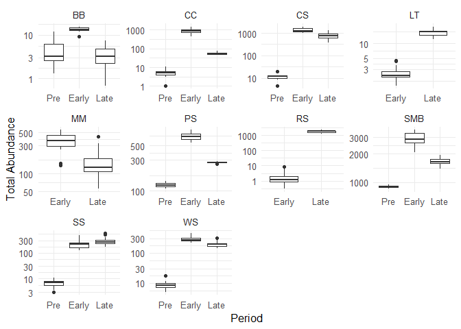
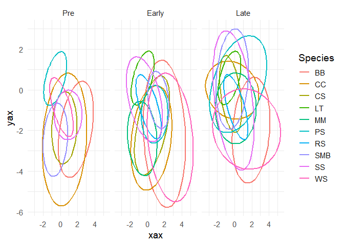

# Introduction

This is an introduction to the components and the generation of the
posterior distributions for the foodweb landscapes of Little Moose.
Below you will find snippits of code and examples of the data frames
that are used during this process. Here we will look at the data frames
that are associated with the `step1_LML_source_L.R` file. However, the
graphs will display the results of the posterior generation for both the
early and late periods of this experiment.

------------------------------------------------------------------------

## Define starting conditions for the model snippits.

For all periods of this experiment, we will be looking at 20 posterior
draws `n.posts`, 10 species `n_species`, 32 sites around the shore of
Little Moose Lake `n_sites`, and 4 years `n_years`. The early period
includes the years 2001-2004 and the late period includes the years
2019-2022.

    # Model conditions
    n.posts = 20
    n_species = 10
    n_sites = 32
    n_years = year_max - year_min -1 # seems missing 2023 data?

We begin by setting names for the data frame that holds the posterior
distributions. These names are composed of useful information that we
can later filter by. For example, `N_1_1_1` is the posterior
distribution for the estimated true abundance of species 1 at site 1
during the first year of that period.

    ##      N_1_1_1    N_2_1_1     N_3_1_1    N_4_1_1    N_5_1_1
    ## 1 0.59851781 0.12491576 0.064379147 0.06836586 0.19647239
    ## 2 0.06378990 0.13306315 0.011529180 0.07449898 0.11340538
    ## 3 0.09515627 0.18297682 0.053681820 0.04944066 0.05948898
    ## 4 0.17242836 0.08188777 0.105136107 0.05425963 1.28713593
    ## 5 0.02373143 0.05949342 0.008167276 0.01352229 0.03003464
    ## 6 0.08046364 0.35059761 0.033201200 0.03798621 0.07619797

But the entire posterior distribution is a large data frame. At this
point, we are not subsetting the posterior distribution and the
abundances are estimated at each site, at each year, for each species.
This results in a large number of columns.

    dim(chain_dat)

    ## [1] 4000 1030

## Subsetting the compontents of the landscape generation.

We begin with sigma. Sigma represents the shape of the isotope ellipse
for each species.It is composed of a covariance matrix.

Below we see an example of the sigma data from the posterior
distribution.

    ## # A tibble: 6 × 6
    ##    post species Sigma_1_1 Sigma_2_1 Sigma_1_2 Sigma_2_2
    ##   <int> <chr>       <dbl>     <dbl>     <dbl>     <dbl>
    ## 1     1 1           1.36    -0.301    -0.301      0.741
    ## 2     1 2           0.659   -0.0269   -0.0269     0.137
    ## 3     1 3           0.163   -0.140    -0.140      0.637
    ## 4     1 4           0.341    0.187     0.187      0.321
    ## 5     1 5           0.885   -0.0689   -0.0689     0.406
    ## 6     1 6           1.63     0.518     0.518      0.954

For `species == 1` and `post == 1`, see the below matrix as an example
of what the covariance matrix looks like.

    ##            [,1]       [,2]
    ## [1,]  1.3585628 -0.3012338
    ## [2,] -0.3012338  0.7407447

The mass data is generated through the use of length and weight
relationships for species in Little Moose Lake. The one exception here
is brown bullhead. For brown bullhead, we use weight-length
relationships that are available on FishBase from previously published
research.Below, the estimated length-weight relationships are
represented by a colored curve. The observed length-weight data is
displayed.

See below the structure of the mass data.

    ## # A tibble: 6 × 3
    ##    post species mass.avg
    ##   <int> <chr>      <dbl>
    ## 1     1 1          4.37 
    ## 2     1 2          2.08 
    ## 3     1 3          2.32 
    ## 4     1 4          5.87 
    ## 5     1 5          0.466
    ## 6     1 6          1.29

Comparing the masses of fishes bewteen the two periods. Data from the
posterior for both the late and the early period is loaded in here.

See below for the snippit of the abundance data.

    ## `summarise()` has grouped output by 'post', 'species'. You can override using
    ## the `.groups` argument.

    ## # A tibble: 6 × 4
    ## # Groups:   post, species [2]
    ##    post species  year tot_abund
    ##   <dbl> <chr>   <dbl>     <dbl>
    ## 1     1 1           1      5.23
    ## 2     1 1           2      5.23
    ## 3     1 1           3      5.22
    ## 4     1 2           1     54.8 
    ## 5     1 2           2     54.8 
    ## 6     1 2           3     54.9

See below for a comparison between the estimated total abundance for
both periods.

    ## # A tibble: 6 × 4
    ##    post species    mu_1    mu_2
    ##   <int> <chr>     <dbl>   <dbl>
    ## 1     1 1        1.25   -1.92  
    ## 2     1 2        0.271   0.0365
    ## 3     1 3       -0.554  -0.155 
    ## 4     1 4       -0.562   0.621 
    ## 5     1 5       -0.0347 -0.953 
    ## 6     1 6        0.339   0.242

For this analysis, the mean and sigma of each community’s isotopic web
is centered around zero with a SD of 1. Because of this, the webs appear
in an transformed space. This is to assist in making comparisons across
communities so that the variation within isotopic landscapes of each
system don’t largely influence the webs. Below, you can see a
visualization of the mean centroids and ellipse shape for each species
during each period. Note - that the Pre and Early communities use the
same isotopic data. However, several species (i.e. lake trout, central
mudminnow, and rainbow smelt) are not observed during that period, so
they are excluded from that isotopic web.

Finally, all the previous steps are combined. When applicable
(i.e. where abundances are estimated across multiple years) the
estimates are summarized by mean.

See below for the structure of the final posterior data frame is.

    ## # A tibble: 6 × 10
    ## # Groups:   post [1]
    ##    post species Sigma_1_1 Sigma_2_1 Sigma_1_2 Sigma_2_2 mass.avg tot_abund
    ##   <dbl> <chr>       <dbl>     <dbl>     <dbl>     <dbl>    <dbl>     <dbl>
    ## 1     1 1           1.36    -0.301    -0.301      0.741    4.37       5.23
    ## 2     1 10          3.23     0.700     0.700      1.04     3.80     321.  
    ## 3     1 2           0.659   -0.0269   -0.0269     0.137    2.08      54.8 
    ## 4     1 3           0.163   -0.140    -0.140      0.637    2.32     700.  
    ## 5     1 4           0.341    0.187     0.187      0.321    5.87      17.3 
    ## 6     1 5           0.885   -0.0689   -0.0689     0.406    0.466     55.6 
    ## # ℹ 2 more variables: mu_1 <dbl>, mu_2 <dbl>
