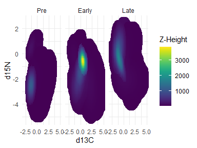
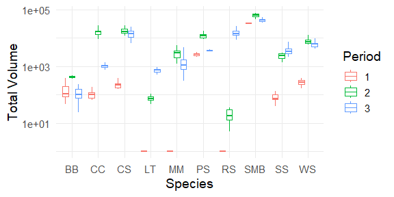

# Introduction

This project aims to combine stable isotope ecology with a long-term
study on the demography of a littoral fish community in Little Moose
lake. By combining the population sizes and observed mass (g) of the
fish species present, we create 3D landscapes for visualizing the
distribution of resource demand across isotopic space.

------------------------------------------------------------------------

### You will need jags - ‘just another gibbs sampler’

[jags for
windows](https://sourceforge.net/projects/mcmc-jags/files/JAGS/4.x/Windows/) -
[jags for
mac](https://sourceforge.net/projects/mcmc-jags/files/JAGS/4.x/Mac%20OS%20X/)

------------------------------------------------------------------------

### You will need to install the following R libraries

    install.packages(c("snow","plotrix", "SIBER","ggplot2",
      "dplyr","ellipse","mixtools","mvtnorm","plot3D",
      "scatterplot3d","scales","viridis","ggplot2","gridExtra"))

------------------------------------------------------------------------

#### The `Landscapes` folder contains further description of the data that goes into these landscapes and visualizations of the components. The figures below demonstrate the desired output of these models.

Through this we can calculate the total volume of each species in the
landscape (as seen below) or examine other landscape metrics (ex.
rugosity) to infer differences between the communities that existed at
each timepoint.

